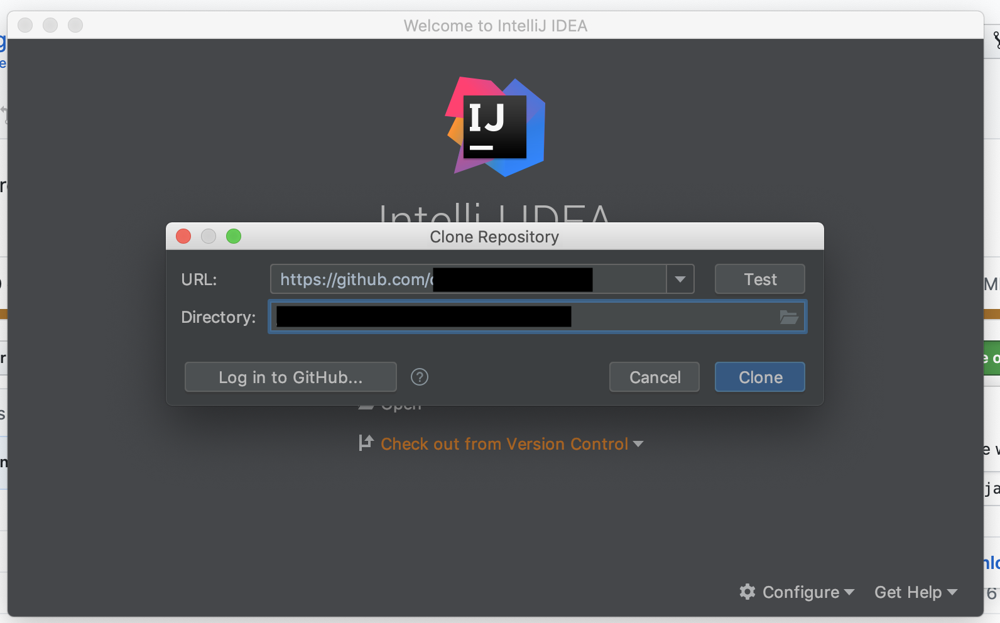
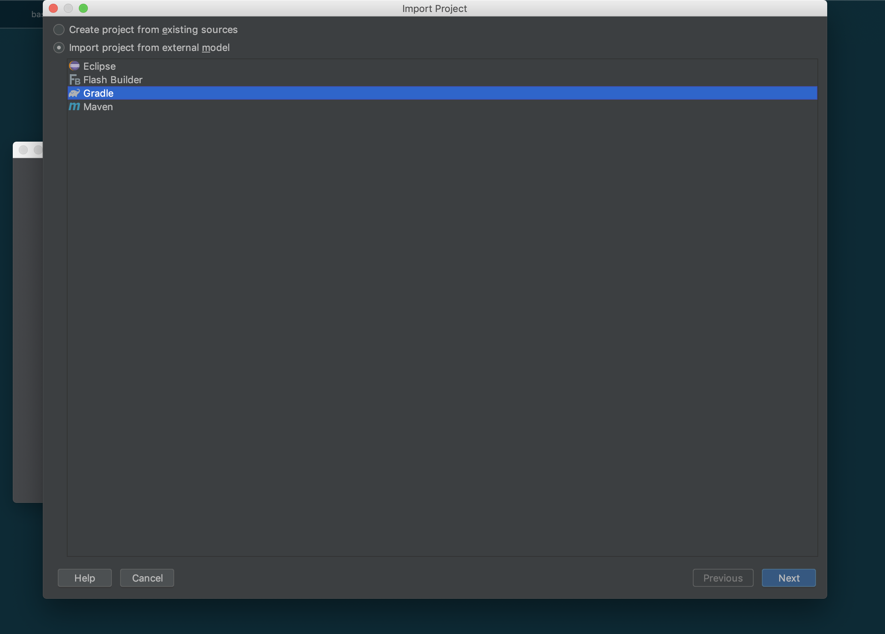
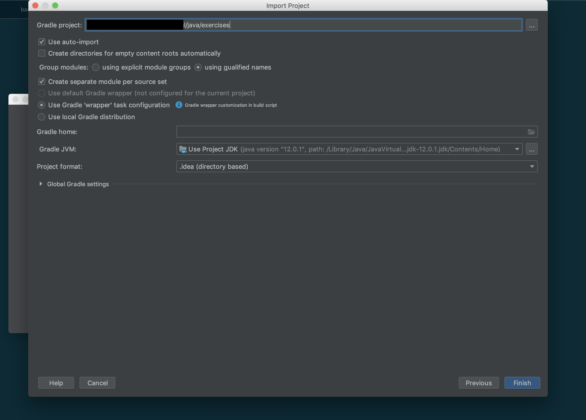
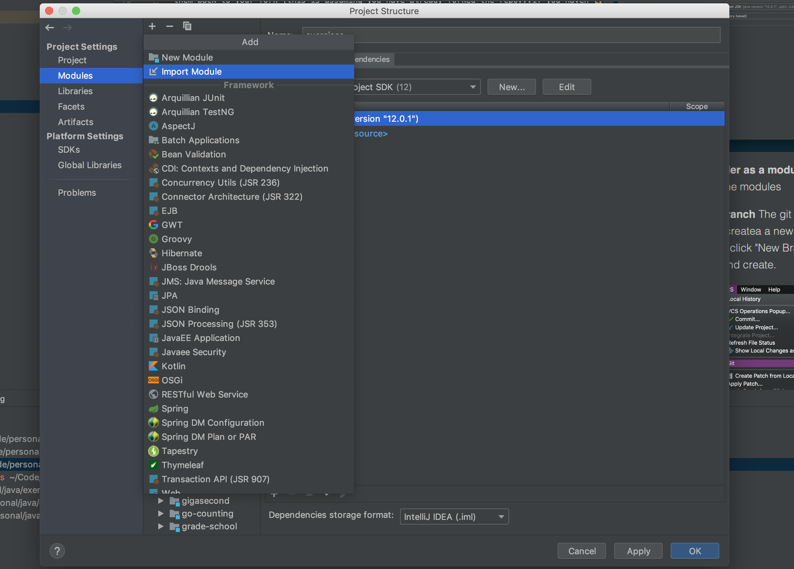
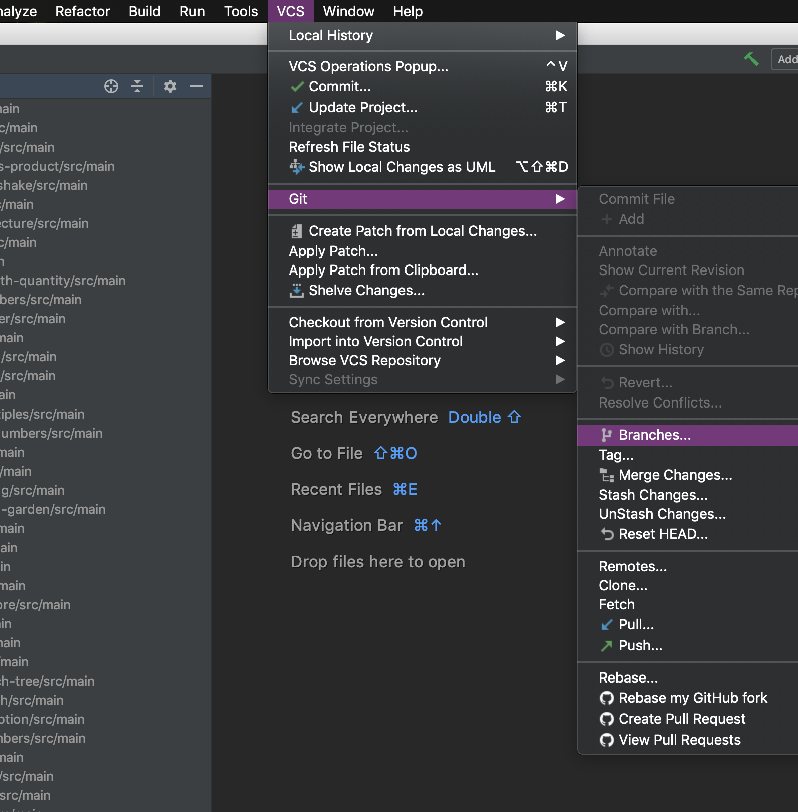
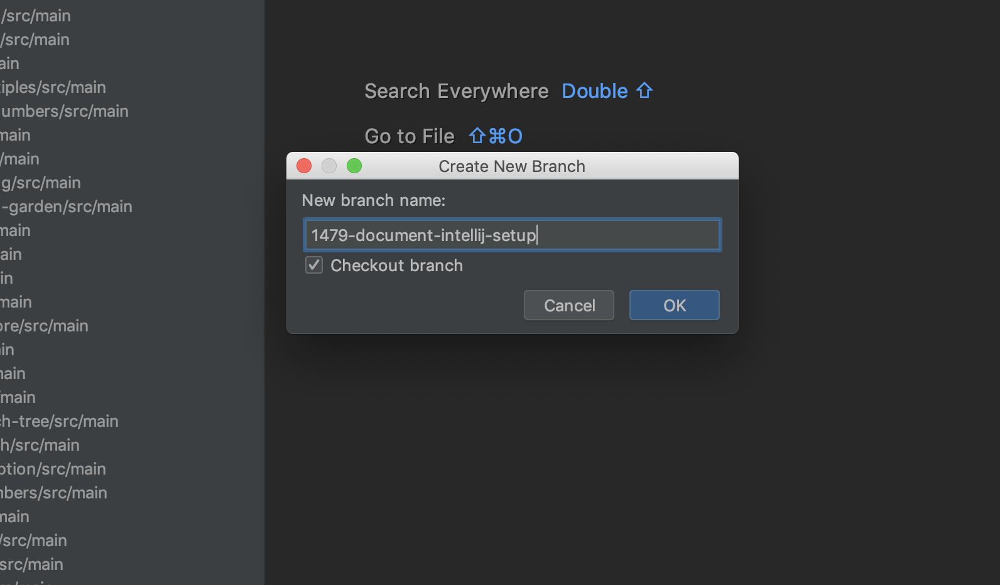
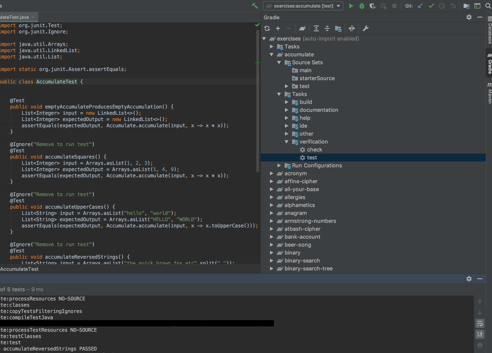
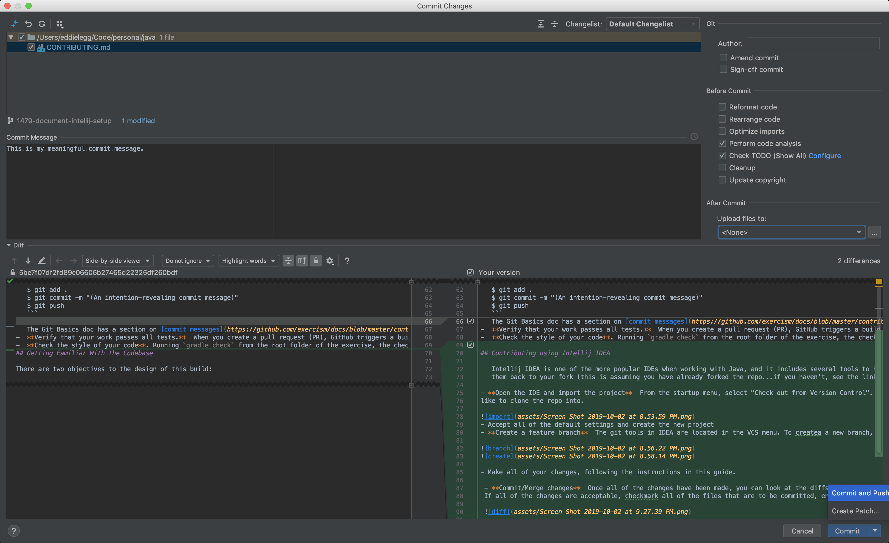

## Table of Contents

* [Overview](#overview)
* [Before Making Your Pull Request](#before-making-your-pull-request)
* [Contributing With Minimal Setup](#contributing-with-minimal-setup)
* [Getting Familiar With the Codebase](#getting-familiar-with-the-codebase)
  * [The `exercises` Module](#the-exercises-module)
  * [The Problem Submodules](#the-problem-submodules)
* [Advanced: Complete Local Setup](#advanced-complete-local-setup)
  * [Tip: `gradle clean` before `exercism fetch`](#tip-gradle-clean-before-exercism-fetch)
* [Adding a New Exercise](#adding-a-new-exercise)
* [Updating the READMEs](#updating-the-readmes)
* [Checking tests are up to date](#checking-tests-are-up-to-date)
* [Checking tests are up to date and submit new issues](#checking-tests-are-up-to-date-and-submit-new-issues)

## Overview

This guide covers contributing to the Java track.  If you are new to the exercism Java track, this guide is for you.

If, at any point, you're having any trouble, pop in the [Gitter exercism/java room](https://gitter.im/exercism/java) or the [Gitter exercism/dev room](https://gitter.im/exercism/dev) for help.

For general guidelines about contributing to Exercism see the [Exercism contributing guide](https://github.com/exercism/docs/tree/master/contributing-to-language-tracks).

## Before Making Your Pull Request

Hi! Thanks for contributing to the Exercism Java track!

Before opening your pull request, please review the [track policies](https://github.com/exercism/java/blob/master/POLICIES.md) and make sure your changes comply with them all.
This helps us focus our review time on the more important aspects of your contributions.

Also please only address one issue per pull request and reference the issue in your pull request. This makes it easier for us to review it, and it means that if we request changes to the fix for one issue, it won't prevent to a fix for another issue being merged.

It's perfectly fine to have more than one pull request open at a time.
In that case it's important to keep the work for each pull request on a separate [branch](https://git-scm.com/book/en/v2/Git-Branching-Branches-in-a-Nutshell) to prevent unrelated commits being added to your pull request. This is good practice to do always, even if you only have one pull request open.

One last thing to note before you get started. When you fork the repository and you want to [sync your fork](https://help.github.com/articles/syncing-a-fork/), you can perform a [`git rebase`](https://git-scm.com/docs/git-rebase). This is preferred over merging the changes because merging leads to a dirty commit history whereas performing a rebase adds in those changes without making extra commit messages. However, this is only preferred, so don't worry about it too much.

## Contributing With Minimal Setup

First things first: by contributing to Exercism, you are making this learning tool that much better and improving our industry as a whole... thank you!!!

To submit a fix for an existing exercise or port an exercise to Java with the least amount of setup:

1. **Ensure you have the basic Java tooling installed:**  JDK 1.8+, an editor and Gradle 2.x.

   (see [exercism.io: Installing Java](http://exercism.io/languages/java/installation))
-  **Setup a branch on a fork of [exercism/java](https://github.com/exercism/java) on your computer.**

   See [GitHub Help: Forking](https://help.github.com/articles/fork-a-repo/).  Use those instructions (in conjunction with the [Git Basics doc](https://github.com/exercism/docs/blob/master/contributing/git-basics.md)) to:
   * "fork" a repository on GitHub;
   - install `git`;
   - "clone" a copy of your fork;
   - configure an "upstream remote" (in this case, `exercism/java`);
   - create a branch to house your work
-  **Write the codes.**  Do your work on that branch you just created.

   The [Getting Familiar With the Codebase](#getting-familiar-with-the-codebase) section, below, is an orientation.
-  **Commit, push and create a pull request.**

   Something like:
   ```
   $ git add .
   $ git commit -m "(An intention-revealing commit message)"
   $ git push
   ```
   The Git Basics doc has a section on [commit messages](https://github.com/exercism/docs/blob/master/contributing/git-basics.md#commit-messages) that provides practical advice on crafting meaningful commit messages.
-  **Verify that your work passes all tests.**  When you create a pull request (PR), GitHub triggers a build on Travis CI.  Your PR will not be merged unless those tests pass.
-  **Check the style of your code**. Running `gradle check` from the root folder of the exercise, the checkstyle plugin will show you every style violation of your code

## Contributing using Intellij IDEA

   Intellij IDEA is one of the more popular IDEs when working with Java, and it includes several tools to help simplify the process. The following steps outline how to import the git repository, make changes, and push
   them back to your fork (this is assuming you have already forked the repo...if you haven't, see the link about [forking](https://help.github.com/articles/fork-a-repo/)).
   
- **Open the IDE and import the project**  From the startup menu, select "Check out from Version Control". This will open a dialog where you can enter in the URL of the git repository and specify the directory that you would
like to clone the repo into.



- Select "Import Project from External Model" and click the "Gradle" radio



- Set the Gradle properties per the screenshot below. Ensure that the "exercises" folder is selected as the root of the project



- **Add the `java` folder as a module** Open the project settings and view the modules. Click the `+` button, select "Import Module". Select the `java` directory and accept the default values.



- **Create a feature branch**  The git tools in IDEA are located in the VCS menu. To createa a new branch, select VCS > Git > Branches and then click "New Branch". Give the branch a meaningful name and create.




- Make all of your changes, following the instructions in this guide.

- **Testing your changes** Each exercise will have gradle tasks that can be executed from the IDE. To test changes within an exercise, find the gradle task for that folder in the "Gradle" toolbar on the right,
open the Tasks > Verification folder and double click `test`

 

 - **Commit/Merge changes**  Once all of the changes have been made, you can look at the diffs and commit from the "Commit File" window, which can be reached by selecting VCS > Git > Commit File from the top menu.
 If all of the changes are acceptable, checkmark all of the files that are to be committed, enter a meaningful commit message, and then click "Commit and Push".    
 
 
 
 - Follow the instructions regarding creating a pull request into the upstream repo.
 
 **NOTE:** Git and gradle commands can still be run in the command line when using and IDE. The steps outlining how to perform using IDE tools are for convenience only.
 
## Getting Familiar With the Codebase

There are two objectives to the design of this build:

1. when a problem is built from within the `exercism/java` repo (i.e. when you, the contributor, are developing the exercise), the tests run against the reference solution;
2. when a problem is built outside the `exercism/java` repo (when a participant is solving the exercise), the tests run against the "main" code.

This repo is a multi-project gradle build.

### The `exercises` Module

This is the top-level module, contained in the `exercises` directory.  It is a container for the problem sub-modules.

  * its `build.gradle` points the "main" sourceset to the reference solution.
  * its `settings.gradle` names each of the subprojects, one for each problem in the set.

### The Problem Submodules

The `exercises` subdirectory contains all of the problem submodules.
Each problem/submodule is a subdirectory of the same name as its slug.

  * its `build.gradle` names dependencies required to work that problem.
  * its `README.md` describes the exercise.

Each problem/submodule has three source sets:

* `src/test/java/` — a test suite defining the edges of the problem
* `.meta/src/reference/java/` — a reference solution that passes all the tests
* `src/main/java/` — starter source file(s).

----

## Advanced: Complete Local Setup

### Prerequisites
Before you proceed, please ensure that you have `jq` (library that parses JSON) & `ruby` installed on your machine.

##### Debian Linux
`sudo apt-get install jq ruby-full`

##### macOS
`brew install jq ruby`

If you are going to make significant contribution(s) to the track, you might find it handy to have a complete local install of exercism on your computer.  This way, you can run the full suite of tests without having to create/update a PR.

The easiest way to achieve this is simply use the `bin/journey-test.sh` script.  However, you may want to perform other tests, depending on what you are doing.  You can do so by duplicating the setup performed by the `bin/journey-test.sh` script.

## Adding a New Exercise

The easiest way to add a new exercise to the Java track is to port an exercise from another track.
That means that you take an exercise that has already been implemented in another language and you implement it in this track.

To add a completely new exercise you need to open a pull request to the [problem specifications repository](https://github.com/exercism/problem-specifications/tree/master/exercises).
Any completely new exercise needs to be added and accepted there before it can be added to the Java track.

There is a [general Exercism guide for porting an exercise to a new language](https://github.com/exercism/docs/blob/master/you-can-help/implement-an-exercise-from-specification.md).
Please review this before porting an exercise to the Java track.

See [here](http://exercism.io/languages/java/todo) for a list of exercises that have yet to be implemented on the Java track and can therefore be ported to this track.
Please make sure no one else has a pull request open to implement your chosen exercise before you start.

It might also be a good idea to open a WIP pull request to make it clear to others that you are working on this exercise.
This can just be a pull request with an empty commit that states which new exercise you're working on, with WIP (work in progress) in the title so that the maintainers know that it's not ready for review yet.

The Java specific details you need to know about adding an exercise are:

* Please add an entry to the `exercises` array in `config.json`. You can find details about what should be in that entry [here](https://github.com/exercism/docs/blob/master/language-tracks/configuration/exercises.md).
You can also look at other entries in `config.json` as examples and try to mimic them.

* Please add an entry for your exercise to `settings.gradle`.
This should just be `include 'exercise-name'`.
This list is in alphabetical order so please add your exercise so that it maintains this order.

* Please add an exercise submodule for your exercise.
See [The Problem Submodules](#the-problem-submodules) section for what needs to be in this.
See the [POLICIES doc](https://github.com/exercism/java/blob/master/POLICIES.md#starter-implementations) for an explanation of when you need to add a starter implementation.
The `build.gradle` file can just be copied from any other exercise submodule.
The `README.md` file can be generated using [configlet](https://github.com/exercism/configlet/releases).
You can do this by:

  1. Download configlet and put it somewhere in your [PATH](https://en.wikipedia.org/wiki/PATH_(variable))

  2. Clone [the problem-specifications repository](https://github.com/exercism/problem-specifications).

  3. Run `configlet generate . --only name_of_new_exercise --spec-path path_to_problem_specifications` from the root of this repository.

* Check if there is canonical data for the exercise you're adding.
This can be found at `https://github.com/exercism/problem-specifications/tree/master/exercises/EXERCISE-SLUG/canonical-data.json`.
If there is canonical data for your exercise then you should follow this when making the tests.
We aim to follow the canonical data as closely as possible in our tests to ensure thorough test coverage.
If there is canonical data available you also need to create a file at `exercises/exercise-slug/.meta/version` specifying the canonical data version you have implemented (e.g. `1.0.0`).
The canonical data version can be found at the top of the canonical data file for that exercise.
See other exercises, e.g. [acronym](https://github.com/exercism/java/tree/master/exercises/acronym/.meta), for an example `version` file.

* Make sure you've followed the [track policies](https://github.com/exercism/java/blob/master/POLICIES.md), especially the ones for exercise added/updated.

Hopefully that should be enough information to help you port an exercise to the Java track.
Feel free to open an issue or post in the [Gitter exercism/java room](https://gitter.im/exercism/java) if you have any questions and we'll try and answer as soon as we can.

## Updating the READMEs

The `README.md` files are generated from the exercise descriptions in [problem specifications](https://github.com/exercism/problem-specifications/tree/master/exercises).
They need to be regenerated regularly so that any changes to the descriptions in problem specifications propagate to our READMEs.
This can be done using [configlet](https://github.com/exercism/configlet/releases):

  1. Download configlet and put it somewhere in your [PATH](https://en.wikipedia.org/wiki/PATH_(variable))

  2. Clone [the problem-specifications repository](https://github.com/exercism/problem-specifications).

  3. Run `configlet generate . --spec-path path_to_problem_specifications` from the root of this repository.

## Checking tests are up to date

The tests for each exercise should follow the canonical data in [problem specifications](https://github.com/exercism/problem-specifications/tree/master/exercises) as closely as possible.
The canonical data can change quite regularly, in which case the [canonical data version](https://github.com/exercism/problem-specifications#test-data-versioning) for that exercise will be updated.

We keep track of which version of the canonical data each exercise implements in a version file, for example: https://github.com/exercism/java/blob/master/exercises/two-fer/.meta/version.
Not all exercises have canonical data in problem specifications.
For those that don't we don't add a version file.

We have [a script](https://github.com/exercism/java/blob/master/scripts/canonical_data_check.sh) which can check if these version are up to date with the ones in problem specification.
This script can be used to check if any version files, tests and reference implementations need updating.

To run this script:

  1. Clone [the problem-specifications repository](https://github.com/exercism/problem-specifications).

  2. Run `./scripts/canonical_data_check.sh -t . -s --spec-path path_to_problem_specifications` from the root of this repository.
  
## Checking tests are up to date and submit new issues

There is [a script which allows you to submit new issues](https://github.com/exercism/java/blob/master/scripts/create_issues_versionchange_canonical.sh) to this repo with generic title, description and labels if a change in version was detected.

Example generic new issue:


Before you may submit a new issue, the script
  1. Checks for differences between version numbers of each exercise (in comparison with the version number of the canonical data)
  2. Checks whether an open issue exists for this exercise; if there is an open issue, you will have to check by yourself if the title of the open issue might be changed to include the new version number. Here, it is important to check whether someone is already working on the issue. 
  3. If a new issue may be opened for an exercise, the script will ask you if you want to submit the issue. Entering `y` will create the new issue.

To run this script:

  1. Clone [the problem-specifications repository](https://github.com/exercism/problem-specifications).
  
  2. Create a file `.exercism-version-update-issue-script-settings.sh` in your home directory.
  
  3. In this file, you have to put the following variables:
        - `TOKEN="your_token"`
        - `OWNER="exercism"`
        - `REPO="java"`
        
     For authentication, you need to create a personal token, see [this GitHub page](https://help.github.com/en/articles/creating-a-personal-access-token-for-the-command-line) for more information.

  4. Run `./scripts/create_issues_versionchange_canonical.sh -t . -s --spec-path path_to_problem_specifications` from the root of this repository and follow the directions.
  
  5. If you submitted new issues, please check these submissions on the [issues page](https://github.com/exercism/java/issues).

## Checking exercises are implemented and submit new issues

There is [a script](https://github.com/exercism/java/blob/master/scripts/create_issues_new_exercise.sh) which allows you to easily check if there are any exercism exercises which haven't been implemented in the Java track, and create issues for those exercises if there are any.

Before you may submit a new issue, the script
  1. Checks whether the exercise exists in the Java track (compared to exercism/problem-specifications)
  2. Checks whether an open issue exists for this exercise concerning the implementation of the exercise;
  3. If a new issue may be opened for an exercise, the script will ask you if you want to submit the issue. Entering `y` will create the new issue.

To run this script:

  1. Clone [the problem-specifications repository](https://github.com/exercism/problem-specifications).
  
  2. Create a file `.exercism-version-update-issue-script-settings.sh` in your home directory.
  
  3. In this file, you have to put the following variables:
        - `TOKEN="your_token"`
        - `OWNER="exercism"`
        - `REPO="java"`
        
    For authentication, you need to create a personal token, see [this GitHub page](https://help.github.com/en/articles/creating-a-personal-access-token-for-the-command-line) for more information.

  4. Run `./scripts/create_issues_new_exercise.sh -t . -s --spec-path path_to_problem_specifications` from the root of this repository and follow the directions.
  
  5. If you decide to submit a new issue you can find the opened issue on the [issues page](https://github.com/exercism/java/issues).
